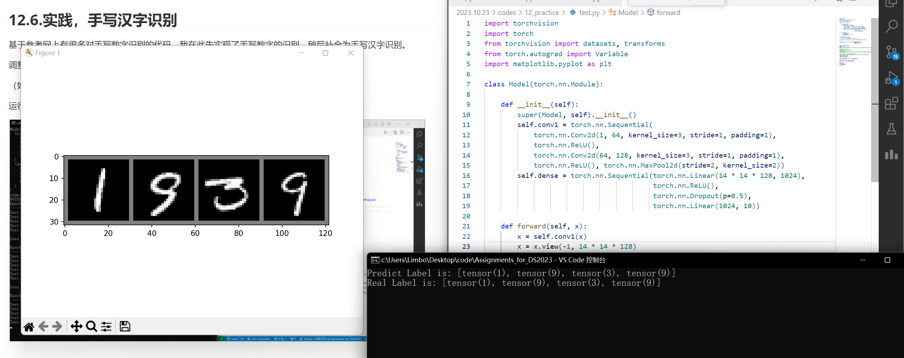

# 题解

## 11.5

## 11.6

如图

## 11.7

rt

## 11.8

## 11.9

取k=3,选取了`petal length` `petal width`两个维度的数据，聚类效果很好。

## 12.6.实践，手写汉字识别

基于参考网上有很多对手写数字识别的代码，我在此先实现了手写数字的识别，稍后补全为手写汉字识别。

调整batch_size=1024后，GPU显存大概占用4.5G（共6G）

（好像训得挺快的（？））

运行demo.py进行训练，如图：

运行test.py进行测试，如图：

很有趣。

## 12.4
