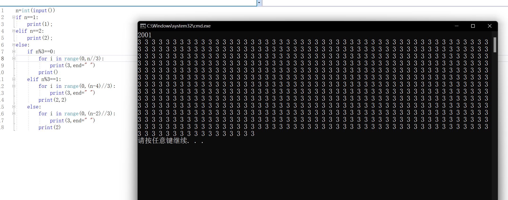
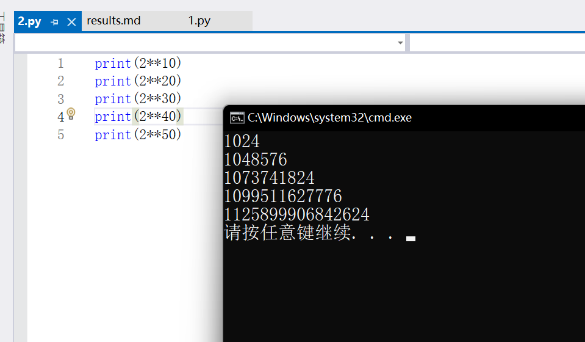
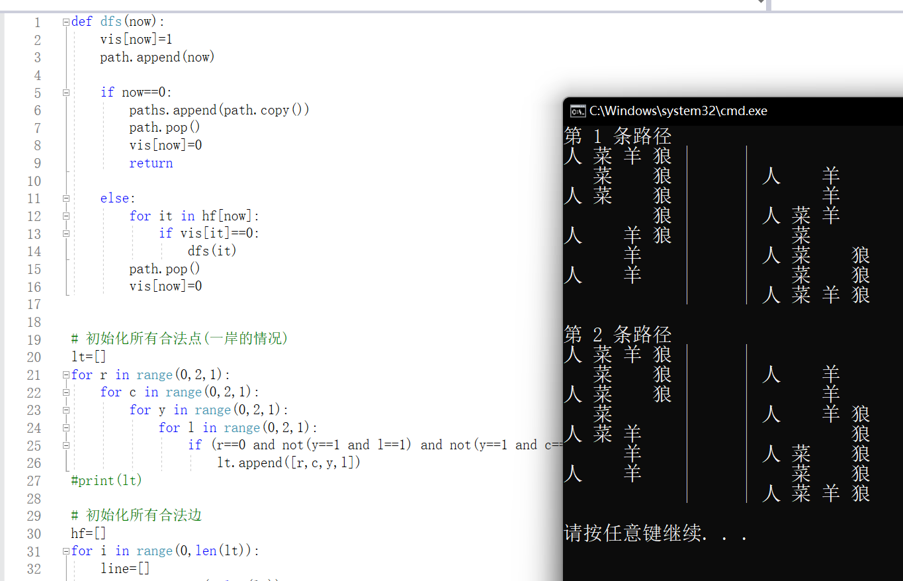
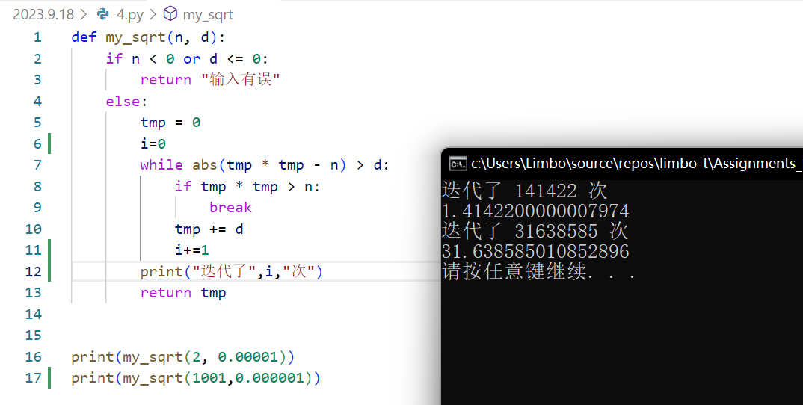
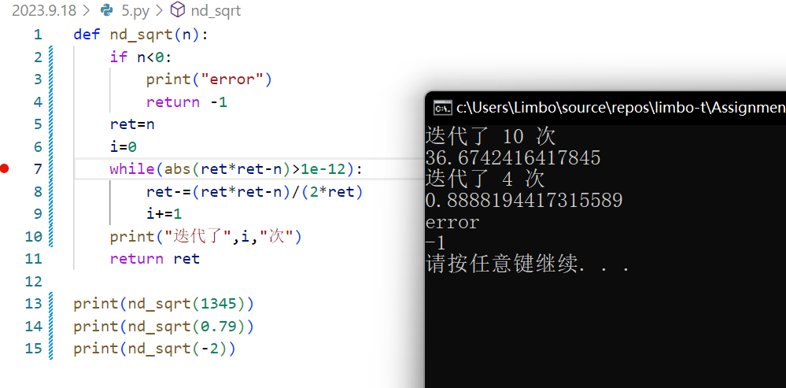
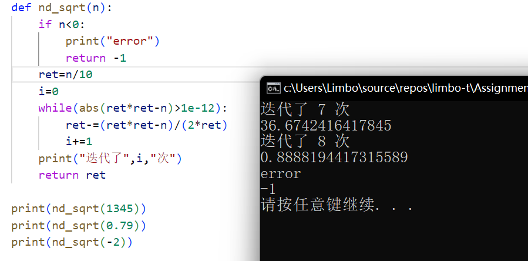
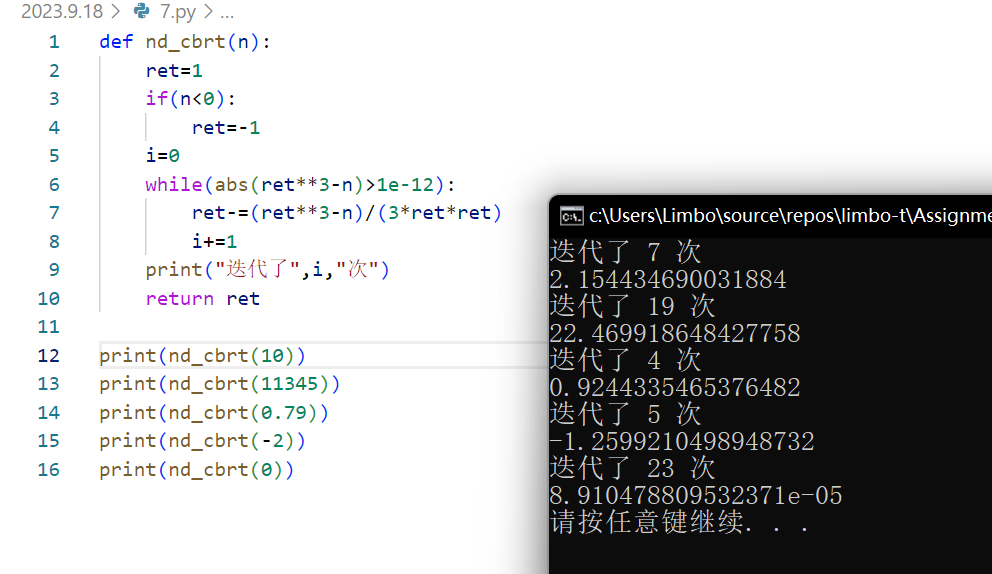

# 题解

## 1

**( 1 )** 正整数数列是`3 3 3 3...3 3 3`

**( 2 )** 

举例，如果分为两个数，肯定尽可能均分时乘积最大。

推广到分为多个数，假如总和为n，分为每个大小都为k的数

那么 

$ans=k^\frac{n}{k}$

求导为 

$ans'=n{k}^{\frac{n}{k}-2}(1-\ln(k))$

在k取e时ans取最大值，又由于ans为整数，所以k取2或3最优。

则分解时应当优先分解为多个3，剩余4时2\*2比1\*3大，小于3的情况特判

**( 3 )** 程序代码见1.py

## 2

代码见文件，指数每增加10，数值相当于*1000，确实是很快的。

## 3

对于代码的解释可以查看注释

## 4

## 5,6

结果如下：

结论：对答案没有影响，但是随着初始g值离$\sqrt{c}$的距离变大，迭代次数可能略变大

## 7

